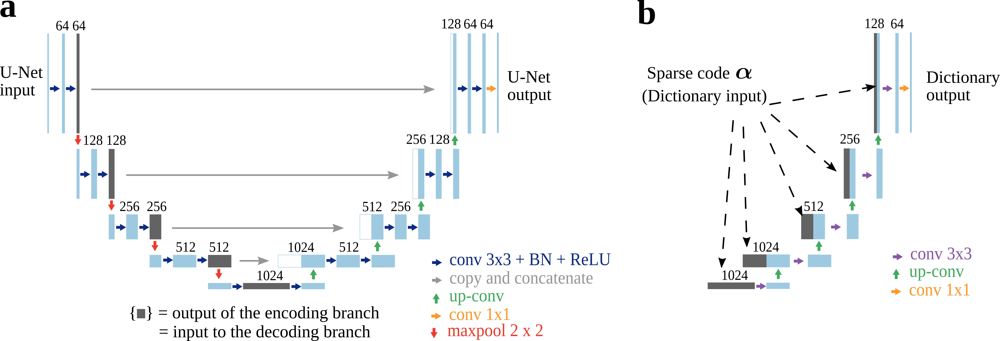

# Interpreting U-Nets via Task-Driven Multiscale Dictionary Learning

**Authors:** Tianlin Liu, Anadi Chaman, David Belius, and Ivan Dokmanić

This repository contains code to reproduce the experiments of our paper "Interpreting U-Nets via Task-Driven Multiscale Dictionary Learning".

## Description
Why have U-Nets been so successful in solving imaging inverse problems? In an effort to understand this, we show that one can reduce a U-Net to a tractable, well-understood sparsity-driven dictionary model while retaining its strong empirical performance. 

We achieve this by extracting a certain multiscale convolutional dictionary from the standard U-Net. This dictionary, visually illustrated below, imitates the structure of the U-Net in its convolution, scale-separation, and skip connection aspects, while doing away with the nonlinear parts.   

   <b>The classic U-Net (left) and the dictionary model considered in this work (right).</b>   

  

Perhaps surprisingly, we show that the reduced, task-driven dictionary model performs comparably to the classic U-Net! The table below showcases their performance (in PSNR) on two major CT and MRI benchmarks: 

|    |      [LoDoPaB-CT](https://arxiv.org/abs/1910.01113) (challenge fold)      |  [fastMRI](https://github.com/facebookresearch/fastMRI) (test fold) |
|----------|:-------------:|:------:|
| Classic U-Net  |    35.87   |   33.1 |
| ISTA U-Net (this work) | 36.09 |    33.0 |

   <b>PSNR performance of the classic U-Net and the ISTA U-Net.</b>   

  

Beyond its strong empirical performance, the derived ISTA U-Net is favorably interpretable: It consists of two modules with well-understood, local objective functions, one implementing sparse coding and the other dictionary-based synthesis. 

## Installation
Code was tested on

* python 3.8.5
* [pytorch](https://pytorch.org/) 1.6.0
* [dival](https://github.com/jleuschn/dival) 0.5.7
* [fastMRI](https://github.com/facebookresearch/fastMRI) 0.1 

## Usage

We trained ISTA U-Net using python scripts in the folder `train_src`. Jupyter notebooks in the folder `notebooks` were used to evaluate and visualize model performance.
